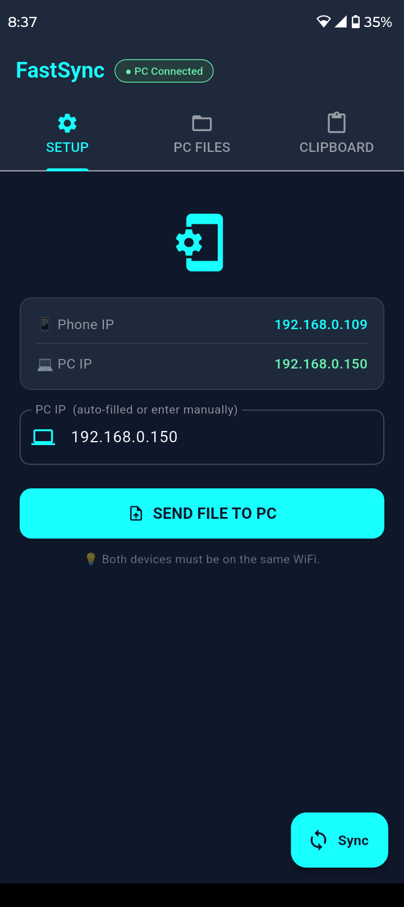
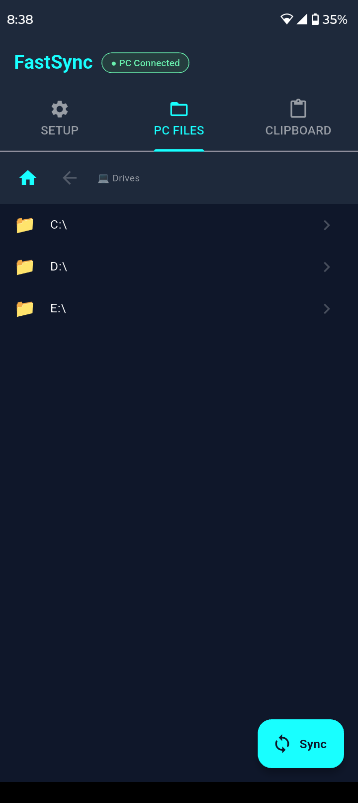
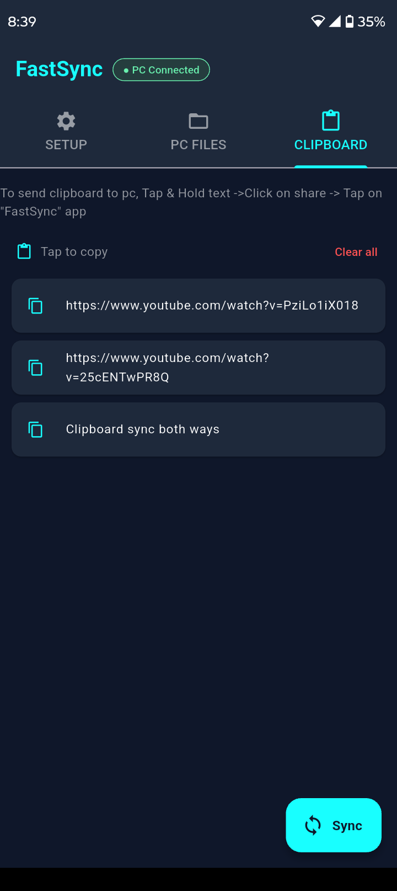
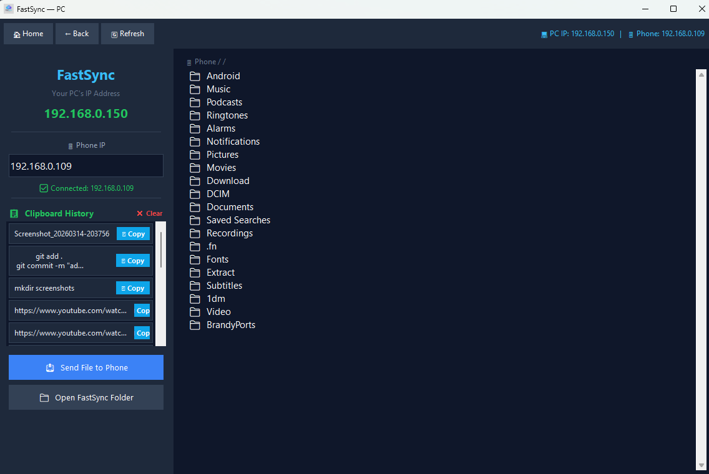

  
  <h1>FastSync</h1>
  
Sync clipboard and files between your PC and Android phone easily

  
  

---

## Download

| Platform | Download |
|----------|----------|
| Windows | [FastSync.exe](https://github.com/arkosarker07/FastSync/releases/latest/download/FastSync.exe) |
| Android | [app-arm64-v8a-release.apk](https://github.com/arkosarker07/FastSync/releases/latest/download/app-arm64-v8a-release.apk) |
| Android | [app-armeabi-v7a-release.apk](https://github.com/arkosarker07/FastSync/releases/latest/download/app-armeabi-v7a-release.apk) |
| Android | [app-x86_64-release.apk](https://github.com/arkosarker07/FastSync/releases/latest/download/app-x86_64-release.apk) |

---

## Features

- Clipboard sync both ways
- Send and receive files both ways
- Browse phone files from PC and pc files from phone
- You can view images,videos,pdfs,music of other connected device

---

## Screenshots

## Screenshots

**Android App**

## Screenshots

**Android App**

**PC Application**

---

## How to Use

1. Install FastSync on PC
2. Install APK on Android
3. Connect both to same WiFi
4. For the First input Pc IP manually if it doesnt connect automatically

---

## Built With
- Python, FastAPI, Tkinter,Flutter
